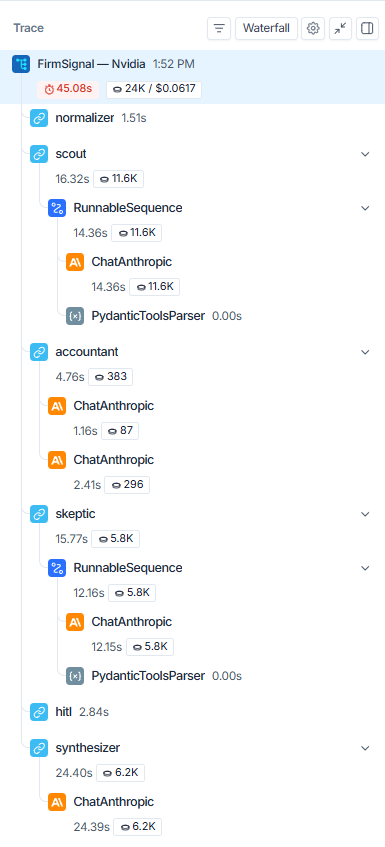
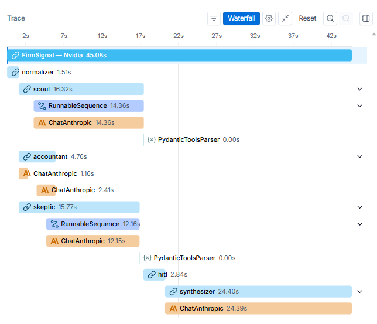
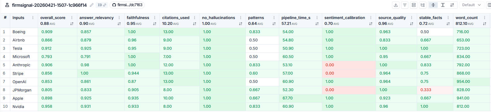

# FirmSignal

Multi-agent company intelligence with a human-in-the-loop checkpoint.
Type a company name — six AI agents research news, financials, and
public sentiment, then pause for your review before generating a
cited intelligence brief.

**Live demo:** https://firmsignal-web.vercel.app
**Backend API:** https://firmsignal-production.up.railway.app/docs

---

## What it does

Give FirmSignal a company name — or a misspelling, a ticker symbol,
or an informal name like "Google" — and within 50 seconds you receive
a structured brief covering recent developments, financial performance,
risk flags with source links, and a bull/bear signal summary.

The pipeline pauses after the Skeptic agent so you can review risk
flags, add an analyst note, and approve before the Synthesizer writes
the final report. This Human-in-the-Loop checkpoint is the core design
decision — controllable AI by architecture, not by prompt.

---

## Agent pipeline

```
User input
    │
    ▼
Normalizer        Resolves misspellings, tickers, informal names
    │             "Googlee" → "Google (Alphabet Inc.)"
    ▼
Scout             Crawls recent news and leadership changes
    │             Tavily search · Redis semantic cache
    ▼
Accountant        Pulls financials and 5-year monthly price history
    │             yfinance · structured Pydantic output
    ▼
Skeptic           Analyses sentiment and surfaces risk flags
    │             Tavily (Glassdoor, controversies, layoffs)
    ▼
[Human Review]    Pauses here — review risk flags, add analyst note
    │             LangGraph interrupt() · Human-in-the-Loop
    ▼
Synthesizer       Writes the final cited brief
                  Claude Sonnet · citation injection
```

---

## Architecture

```
backend/                               frontend/
  firmsignal/                            app/
    agents/          LangGraph nodes       page.tsx              Search
      normalizer.py                        analyze/[runId]/
      scout.py                               page.tsx             Live feed
      accountant.py                          review/page.tsx      HITL panel
      skeptic.py                             report/page.tsx      Final brief
      hitl.py                            components/
      synthesizer.py                       AgentCard.tsx
    api/             FastAPI                StockChart.tsx
      app.py                               CitedBrief.tsx
      routes.py      6 endpoints            RiskBadge.tsx
      runner.py      SSE streaming        lib/
      store.py       Run state              api.ts
      pdf.py         PDF export             useSSE.ts             SSE hook
      models.py      Pydantic schemas     store/
      validation.py                         run.ts                Zustand
      limiter.py     Rate limiting        types/
    tools/                                   index.ts
      cache.py       Redis
      source_quality.py
      retry.py
    graph.py         LangGraph wiring
    state.py         Shared state
    models.py        Domain models
  evals/
    run_evals.py     Automated suite
    eval_utils.py    8-dimension scoring
    deepeval_checks.py
    experiments/     A/B experiments
    golden/          10 companies
```

**API endpoints:**

| Method | Endpoint | Description |
|---|---|---|
| `POST` | `/api/analyze` | Start a run, returns `run_id` |
| `GET` | `/api/stream/{run_id}` | SSE stream of agent progress |
| `POST` | `/api/resume/{run_id}` | Inject HITL decision, resume graph |
| `POST` | `/api/pdf` | Generate PDF export of the brief |
| `GET` | `/api/status/{run_id}` | Poll run status |
| `GET` | `/health` | Health check |

**Interactive API docs (Swagger UI):** 
`http://localhost:8000/docs` locally,
or `https://firmsignal-production.up.railway.app/docs` after deploy.

Auto-generated by FastAPI from Pydantic models — includes request/response
schemas and try-it-out for every endpoint.
---

## Tech stack

**AI / Agents**

| | |
|---|---|
| Agent framework | LangGraph — stateful graph, `interrupt()` / resume, parallel node execution |
| LLM provider | Anthropic Claude — Haiku for research agents, Sonnet for synthesis |
| LLM integration | LangChain + `langchain-anthropic` |
| Structured output | Pydantic v2 + `.with_structured_output()` |
| Web search | Tavily (advanced search depth) |
| Social sentiment | PRAW — Reddit API |
| Financial data | yfinance — 5-year monthly price history |
| Semantic cache | Upstash Redis — deduplicates identical queries |
| Resilience | Tenacity — exponential backoff on LLM + API calls |
| Observability | LangSmith — unified traces, per-agent token counts and cost |
| Evals | DeepEval — faithfulness + answer relevancy LLM-as-judge |

**Backend**

| | |
|---|---|
| API | FastAPI + Server-Sent Events (`sse-starlette`) |
| Runtime | Python 3.11 · Uvicorn · uv |
| Rate limiting | SlowAPI |
| PDF export | ReportLab |
| Database | Supabase |

**Frontend**

| | |
|---|---|
| Framework | Next.js 16 · React 19 · TypeScript |
| Styling | Tailwind CSS v4 · Shadcn/ui · Radix UI |
| State | Zustand v5 |
| Charts | Recharts |
| Streaming | Native `EventSource` / custom `useSSE` hook |

**Deployment**

| | |
|---|---|
| Backend | Railway — Nixpacks build, `on_failure` restart, `/health` check |
| Frontend | Vercel — automatic preview deployments on every push |

---

## Observability

Every pipeline run produces a unified LangSmith trace showing all six
nodes — including the Synthesizer after HITL approval — with per-agent
token counts, latency, and cost visible at the top level.

### Pipeline trace (tree view)



The `hitl` node latency shows how long the human spent on the review
screen. All six nodes appear under a single parent trace so token
counts and cost are summed at the top level.

### Parallel execution (waterfall view)



Scout, Accountant, and Skeptic run simultaneously after the Normalizer
completes. The waterfall shows all three starting within 1-2 seconds
of each other — total research time is determined by the slowest agent
rather than the sum of all three. This reduced average pipeline time
from 57s to 49s (-14%) with no meaningful quality degradation across
10 eval companies.

Eval runs are isolated to a separate `evaluators` LangSmith
project so production traces stay clean.

---

## Evaluation

Automated eval suite across 10 gold standard companies using a two-layer approach.

**Layer 1 — Custom 8-dimension scoring:**

| Dimension | Method |
|---|---|
| Stable facts | String matching — CEO, ticker, HQ |
| Expected patterns | Claude Haiku as judge (yes/no) |
| Forbidden content | String + LLM — catches hallucinations |
| Citation coverage | Regex — factual sentences with [N] |
| Sentiment calibration | Range check against expected range |
| Structure | Section detection — 5 required sections |
| Source quality | Domain allowlist — Reuters, Bloomberg, SEC |
| Private company handling | Schema validation — no fake tickers |

**Layer 2 — DeepEval LLM-as-judge:**
- Faithfulness — did the Synthesizer hallucinate facts not in context?
- Answer Relevancy — does the brief answer the investor's question?


## Eval Results — April 2026 (parallel execution, 10 companies):


| Summary metric | Sequential | Parallel | Change |
|---|---|---|---|
| Overall average | 87.6 / 100 | 89.0 / 100 | +1.4 |
| Avg pipeline time | 57s | 49s | **−14%** |
| No hallucinations | 10 / 10 | 10 / 10 | — |
| Faithfulness (DeepEval) | 0.95 | 0.94 | −0.01 |
| Answer Relevancy (DeepEval) | 0.89 | 0.89 | — |

Parallel execution (Scout + Accountant + Skeptic running 
simultaneously) reduced pipeline time by 14% with no meaningful 
quality degradation. No hallucinations across all 10 companies 
in both configurations.

**Golden dataset:** 10 companies covering public/private, high/low sentiment, different sectors (tech, aerospace, finance, travel). Each golden file contains stable facts, expected patterns, forbidden content checks, and quality thresholds. Files are in `backend/evals/golden/` and should be re-verified every 90 days (`last_verified` field tracks this).

**Results — April 2026** (full experiment tracked in LangSmith):



---

## Cost per report

| Component | Cost |
|---|---|
| Scout — 2 Tavily searches | ~$0.025 |
| Accountant — yfinance | free |
| Skeptic — 3 Tavily searches | ~$0.015 |
| Normalizer + Scout + Skeptic — Claude Haiku | ~$0.040 |
| Synthesizer — Claude Sonnet | ~$0.020 |
| **Total per report** | **~$0.060** |

Redis semantic caching reduces Tavily costs by ~60% on repeat queries for the same company within 24 hours.

---

## Source quality

FirmSignal filters sources at three layers before any agent sees them:

1. **Tavily domain allowlist** — only queries trusted domains (Reuters, Bloomberg, FT, WSJ, SEC, Glassdoor, TechCrunch etc.)
2. **Blocked title filter** — rejects Cloudflare challenge pages, 404s, and access-denied responses by title
3. **Synthesizer prompt** — instructed to prefer primary sources and label unconfirmed claims as "reported" or "alleged"

Sources are displayed in the final report grouped by agent with a quality tier badge (primary / verified / secondary).

---

## Human-in-the-Loop

After the Skeptic runs, the graph pauses using LangGraph's `interrupt()` function. The frontend receives a `hitl_required` SSE event and renders the review panel showing risk flags, sentiment score, and positive signals.

The human can:
- Review and expand each risk flag with its source link
- Add an analyst note that the Synthesizer incorporates
- Approve to generate the report
- Abort to discard the run

On approval, `POST /api/resume/{run_id}` fires `Command(resume=...)` which resumes the graph from the exact point it paused — no agents re-run, no data is lost.

This is the pattern enterprise AI teams use for controllable systems — the human is in the loop by architecture, not by prompt.

---

## Running locally

**Prerequisites:** Python 3.11, Node.js 18+, uv

**Backend:**

```bash
cd backend
cp .env.example .env
# Fill in API keys (see .env.example for all required keys)
uv sync
uv run uvicorn firmsignal.api.app:app --reload --port 8000
```

**Frontend:**

```bash
cd frontend
cp .env.local.example .env.local
# Set NEXT_PUBLIC_API_URL=http://localhost:8000/api
npm install
npm run dev
```

Open `http://localhost:3000`

**Required API keys:**

| Key | Where to get it |
|---|---|
| `ANTHROPIC_API_KEY` | console.anthropic.com |
| `TAVILY_API_KEY` | tavily.com (free: 1K req/month) |
| `LANGCHAIN_API_KEY` | smith.langchain.com (free tier) |
| `UPSTASH_REDIS_URL` | upstash.com (free tier) |
| `UPSTASH_REDIS_TOKEN` | upstash.com (free tier) |

**Optional:**

| Key | Enables |
|---|---|
| `OPENAI_API_KEY` | DeepEval Faithfulness + Relevancy metrics |

---

## Running evals

```bash
cd backend

# Single company — fastest, use during development
uv run python -m evals.run_evals --company stripe --fast

# Full suite — 10 companies, ~20 min, ~$1.50 in API costs
uv run python -m evals.run_evals

# Fast mode — skips LLM pattern checks, saves ~$0.50
uv run python -m evals.run_evals --fast
```

Results are saved to `backend/evals/results/latest.json` and a timestamped archive. The README-ready summary table prints at the end of every full run.

---

## Deployment

| Service | Platform | Config |
|---|---|---|
| Backend (FastAPI) | Railway | Root: `backend/` · Start: `uvicorn firmsignal.api.app:app --host 0.0.0.0 --port $PORT` |
| Frontend (Next.js) | Vercel | Root: `frontend/` · Framework: Next.js |

Both deploy from the same monorepo. Railway and Vercel each watch their respective subdirectory for changes.

**Deploy order:**
1. Deploy backend to Railway first — copy the Railway URL
2. Deploy frontend to Vercel — set `NEXT_PUBLIC_API_URL` to the Railway URL
3. Go back to Railway — set `ALLOWED_ORIGINS` to the Vercel URL
4. Redeploy backend once to pick up the CORS change

> **Note:** Run state is held in memory (LangGraph MemorySaver).
> A server restart during the HITL review step will lose the active run.
> Persistent storage via Supabase is planned — this also enables
> watchlist features and historical report storage.

---

## Design decisions

**Claude Haiku for research, Sonnet only for synthesis.** The most expensive model is reserved for the one task where prose quality directly determines user value. Research agents extract structured data where speed and cost matter more than creativity.

**Semantic cache on Tavily.** The same company queried twice within 24 hours hits Redis instead of the API. Reduced Tavily costs by ~60% during development and makes demos faster.

**Pydantic structured output on every agent.** `.with_structured_output()` uses Anthropic's tool-use API under the hood, which is more reliable than asking for JSON in the prompt. Every agent output is validated before it enters the graph state.

**Source domain allowlist before search.** Tavily's `include_domains` parameter prevents low-quality sources from entering the pipeline at all, rather than filtering them out afterward. LinkedIn personal posts and Medium articles are excluded at the search layer.

**Two-layer eval design.** Custom mechanical checks (string matching, regex, range checks) run fast and free. LLM-as-judge (Claude Haiku + DeepEval) handles checks that require semantic understanding. Neither layer replaces the other.

**HITL by architecture, not prompt.** The human review step uses LangGraph's `interrupt()` function which freezes the entire graph state. It cannot be bypassed by a clever prompt — the graph is literally paused at the OS level until `Command(resume=...)` is called.

---

## Tests

```bash
cd backend
uv run pytest tests/ -v
```

38 tests — all run offline with no external API calls.

| Layer | File | What it tests |
|---|---|---|
| Unit | `test_validation.py` | Input sanitization — empty, too long, XSS, blocked words |
| Unit | `test_source_quality.py` | Domain allowlist, blocked titles, tier scoring |
| Unit | `test_cache.py` | Redis key generation — deterministic, case-insensitive |
| Unit | `test_eval_utils.py` | Scoring logic — facts, citations, forbidden content, sentiment |
| API | `test_routes.py` | All endpoints — 422 validation, 404 handling, mocked pipeline |


## Experiments

### Skeptic evidence threshold

Tested three evidence threshold variants across Boeing, Nvidia,
and Tesla to find the optimal balance between risk coverage
and accuracy.

| Variant | Avg score | Hallucinations | Patterns | Risk flags |
|---|---|---|---|---|
| Baseline (one credible source) | 90.9 / 100 | 0% | 83.3% | 5.0 avg |
| Strict (two independent sources) | 93.6 / 100 | 0% | 88.9% | 5.0 avg |
| Aggressive (any source) | 86.4 / 100 | 0% | 77.8% | 5.0 avg |

**Key findings:**
- Zero hallucinations across all variants — source filtering
  is robust regardless of evidence threshold
- Strict mode outperformed baseline (93.6 vs 90.9) — requiring
  two independent sources raised the evidence bar, producing
  more precise flag descriptions that scored higher on pattern
  coverage
- Aggressive mode degraded citation quality (Boeing dropped
  from 1.0 to 0.5) as unverified single-source claims
  reduced factual density
- Risk flag count identical across variants — Claude reaches
  the configured maximum (5) in all cases, variants affect
  flag quality not quantity

**Decision:** kept baseline despite strict mode's higher score.
Strict mode would miss genuine single-source risks in breaking
news scenarios where only one outlet has reported an event.
The quality gain does not justify the coverage loss.

*Full results: `backend/evals/results/experiment_skeptic_strictness.json`*
*LangSmith: Datasets → firmsignal-golden-10 → Experiments
(filter by `skeptic-baseline`, `skeptic-strict`, `skeptic-aggressive`)*